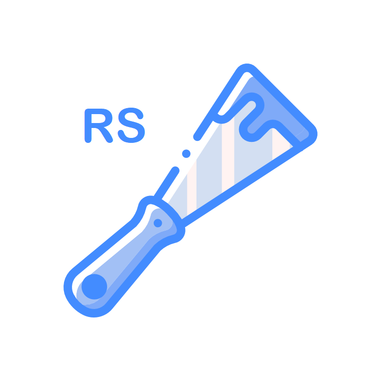

[![Forks][forks-shield]][forks-url]
[![Stargazers][stars-shield]][stars-url]
[![Issues][issues-shield]][issues-url]
[![LinkedIn][linkedin-shield]][linkedin-url]

<!-- PROJECT LOGO -->
 

  
  <h3 align="center">RedditScraperBot</h3>

  

    A Discord bot written using Discord.py that can scrape subreddit for links and post them on the server.
  

<!-- TABLE OF CONTENTS -->

  
Table of Contents

  <ol>
    <li>
      <a href="#about-the-project">About The Project</a>
    </li>
    <li><a href="#usage">Usage</a></li>
    <li><a href="#license">License</a></li>
    <li><a href="#contact">Contact</a></li>
  </ol>

<!-- ABOUT THE PROJECT -->
## About The Project

- A Discord bot written using Discord.py that can scrape subreddit for links and post them on the server.

<!-- USAGE EXAMPLES -->
## Usage

- Need to be hosted on a seperate hosting site and added to Discord as a bot using Discord Developer Portal.

<!-- LICENSE -->
## License

- Distributed under the GPL-3.0 License. See `LICENSE` for more information.

<!-- WHAT I LEARNT -->
## What I Learnt

- The process of hosting a bot or a site on a hosting platform like Heroku
- Using listeners and responders of Discord.py
- Updating deployed applications

<!-- CONTACT -->
## Contact

Navin Pemarathne - navin.pemarathne@gmail.com

Project Link: [https://github.com/NavinYP/RedditScrapperBot](https://github.com/NavinYP/RedditScrapperBot)

<!-- MARKDOWN LINKS & IMAGES -->
<!-- https://www.markdownguide.org/basic-syntax/#reference-style-links -->
[contributors-shield]: https://img.shields.io/github/contributors/NavinYP/RedditScrapperBot.svg?style=for-the-badge
[contributors-url]: https://github.com/NavinYP/RedditScrapperBot/graphs/contributors
[forks-shield]: https://img.shields.io/github/forks/NavinYP/RedditScrapperBot.svg?style=for-the-badge
[forks-url]: https://github.com/othneildrew/NavinYP/RedditScrapperBot/network/members
[stars-shield]: https://img.shields.io/github/stars/NavinYP/RedditScrapperBot.svg?style=for-the-badge
[stars-url]: https://github.com/othneildrew/NavinYP/RedditScrapperBot/stargazers
[issues-shield]: https://img.shields.io/github/issues/NavinYP/RedditScrapperBot.svg?style=for-the-badge
[issues-url]: https://github.com/NavinYP/RedditScrapperBot/issues
[license-shield]: https://img.shields.io/github/license/NavinYP/RedditScrapperBot.svg?style=for-the-badge
[license-url]: https://github.com/NavinYP/RedditScrapperBot/master/LICENSE.txt
[linkedin-shield]: https://img.shields.io/badge/-LinkedIn-black.svg?style=for-the-badge&logo=linkedin&colorB=555
[linkedin-url]: https://www.linkedin.com/in/navin-pemarathne/
[product-screenshot]: images/screenshot.png
